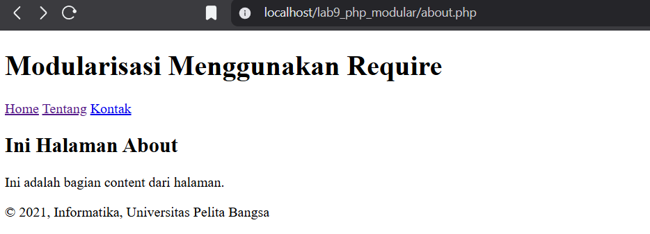
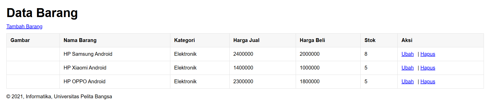
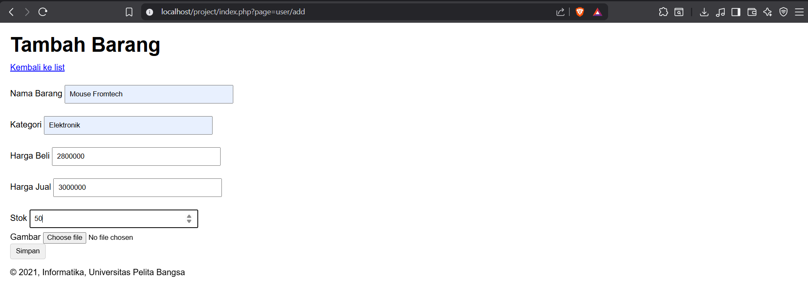
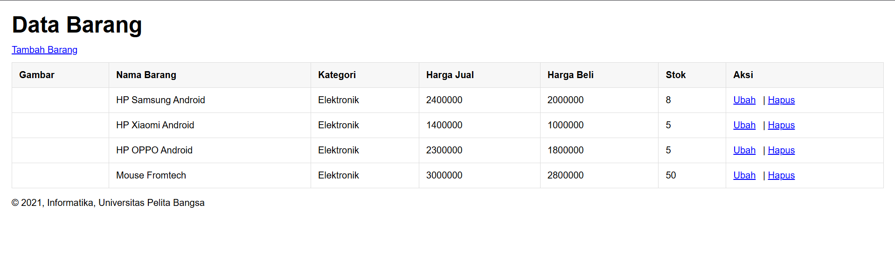
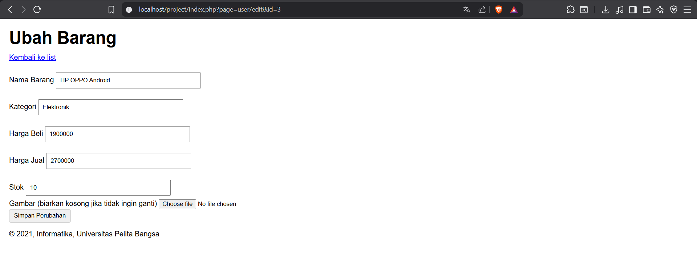
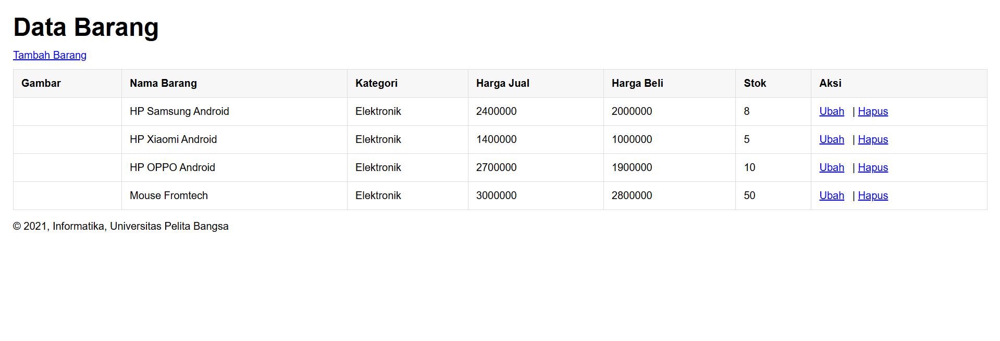
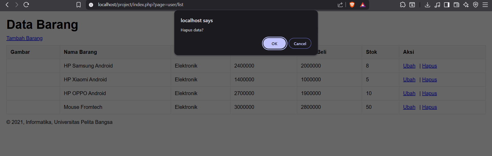
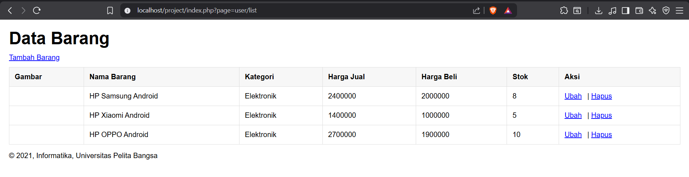

# Praktikum 9: PHP Modular

## Nama: Albhani Fadillah Haryady
## NIM: 312410130
## Kelas: TI 24 A1

### Langkah-langkah Pratikum

#### 1. header.php
```html
<!DOCTYPE html>
<html lang="en">
  <head>
    <meta charset="UTF-8" />
    <title>Contoh Modularisasi</title>
    <link
      href="style.css"
      rel="stylesheet"
      type="text/stylesheet"
      media="screen"
    />
  </head>
  <body>
    <div class="container">
      <header>
        <h1>Modularisasi Menggunakan Require</h1>
      </header>
      <nav>
        <a href="home.php">Home</a>
        <a href="about.php">Tentang</a>
        <a href="kontak.php">Kontak</a>
      </nav>
    </div>
  </body>
</html>
```
#### 2. footer.php
```html
        <footer>
            <p>&copy; 2021, Informatika, Universitas Pelita Bangsa</p>
        </footer>
    </div>
</body>
</html>
```
#### 3. home.php
```php
<?php require('header.php'); ?>

<div class="content">
    <h2>Ini Halaman Home</h2>
    <p>Ini adalah bagian content dari halaman.</p>
</div>

<?php require('footer.php'); ?>
```
#### 4. about.php
```php
<?php require('header.php'); ?>

<div class="content">
    <h2>Ini Halaman About</h2>
    <p>Ini adalah bagian content dari halaman.</p>
</div>

<?php require('footer.php'); ?>
```



### Pertanyaan dan Tugas
Implementasikan konsep modularisasi pada kode program praktikum 8 tentang database,
sehingga setiap halamannya memiliki template tampilan yang sama. Dan terapkan
penggunaan Routing agar project menjadi lebih modular.
Gunakan struktur direktory seperti berikut:
```Markdown
project/
├── index.php
├── config/
│   └── database.php
├── views/
│   ├── header.php
│   ├── footer.php
│   └── dashboard.php
├── modules/
│   ├── user/
│   │   ├── list.php
│   │   └── add.php
│   └── auth/
│       ├── login.php
│       └── logout.php
└── assets/
    ├── css/
    └── js/
```

Routing menggunakan url: index.php?page=user/list
Opsional: Gunakan htaccess agar url lebih SEO Friendly.
Contoh URL: (base-domain)/user/list

### Jawaban:

#### Tampilan Awal


#### Tambah Barang



#### Ubah



#### Hapus (dan bisa terlihat routingnya seperti contoh URL yang ada di Pertanyaan dan Tugas)



#### Struktur Folder
```markdown
./
├── .htaccess
├── index.php
├── assets/
│   ├── css/
│   │   └── style.css
│   ├── img/
│   └── js/
├── config/
│   └── database.php
├── modules/
│   ├── auth/
│   │   ├── login.php
│   │   └── logout.php
│   └── user/
│       ├── add.php
│       ├── delete.php
│       ├── edit.php
│       └── list.php
└── views/
    ├── footer.php
    └── header.php
```